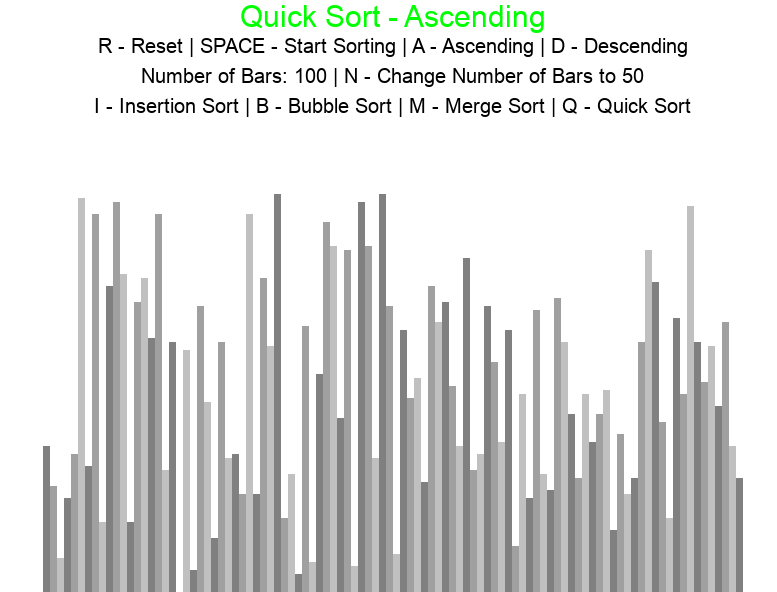

# Sorting Algorithm Visualization Module

Used Pygame in Python to create an interactive module that shows how common sorting algorithms sort data, including insertion sort, bubble sort, merge sort, and quick sort. The biggest challenge in this project was getting the module to show each step of the sorting for recursive algorithms like merge sort and quick sort.

### How to use:
Pressing different keys makes different events happen, which are all listed on the graphical user interface in the module. These events include: 
- Changing the sorting algorithm
- Changing if the bars are to be sorted in ascending or descending order
- Toggling the number of bars between 50 and 100
- Starting the sorting of the bars
- Resetting the bars to their random state

### Video example:

